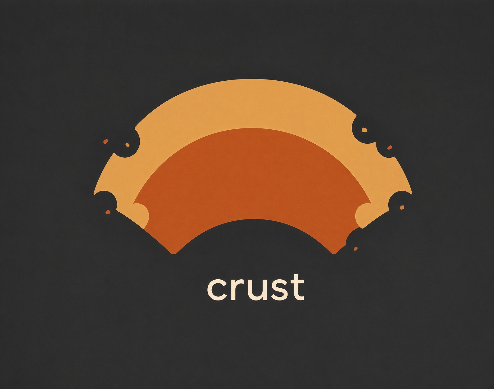
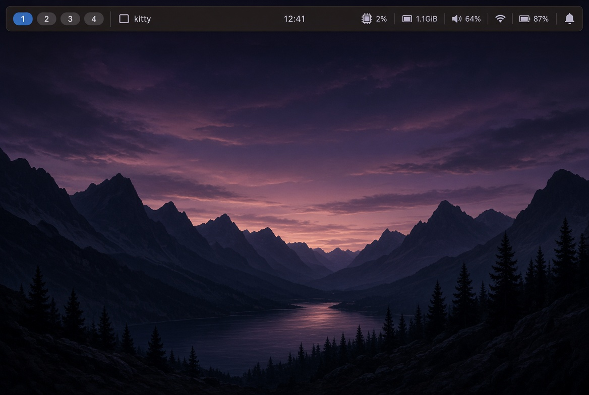
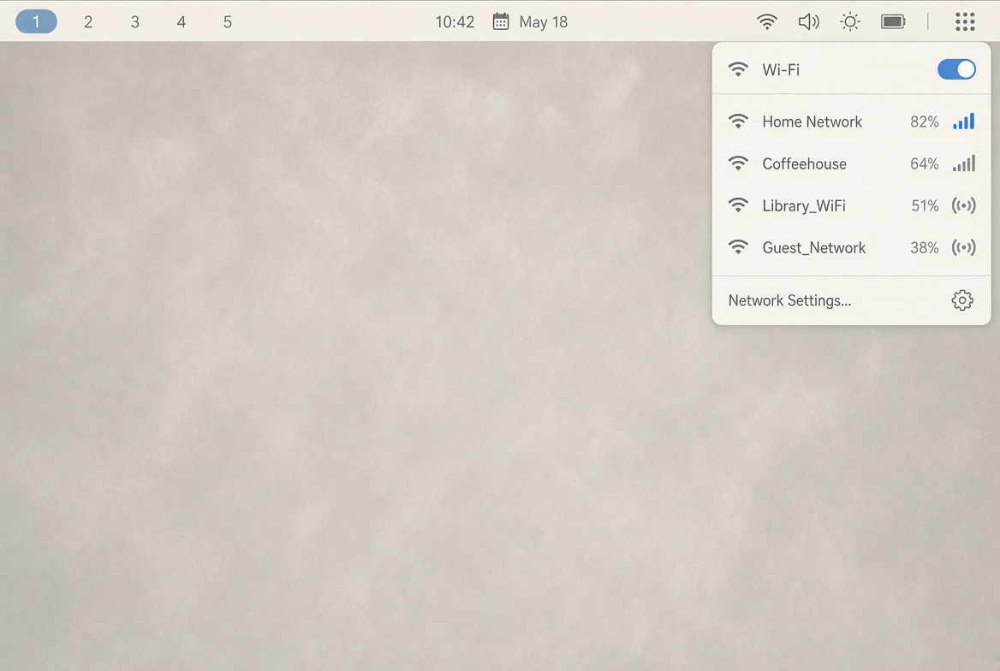
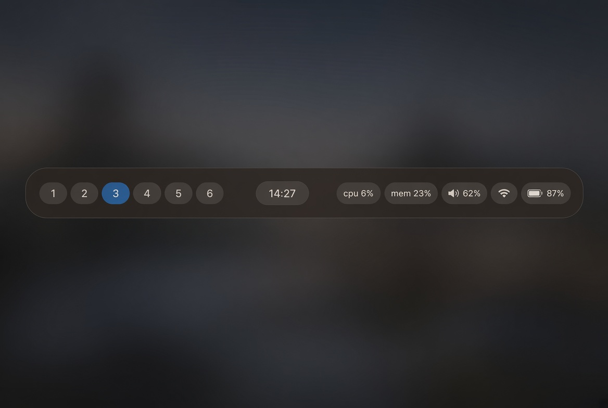

# crust



A status bar for Hyprland, written in Rust. It sits on the edge of the screen, which is also where the crust of a pizza sits. That is the whole joke.

crust is a layer-shell bar. You describe modules in a TOML file and style them with short class strings that look like Tailwind (`px-2`, `rounded-md`, `bg-surface/90`). There is no webview and no GTK. The first time you run it, if you do not already have a config, it writes one and opens a mocha bar.

The pictures below are concept renders, not screenshots of a release build. Your bar looks like whatever you put in the config. The default is closer to the dark strip than the floating pill.








## What you get

Workspaces (click to focus), focused window title, clock, cpu, memory, volume, wifi, battery, notifications, a static label, and `exec` for anything else.

Wifi can open a drawer that lists networks and connects through NetworkManager. That drawer is newer than the bar. Treat it as useful, not finished. A connect still blocks the overlay until `nmcli` returns.

Themes are `mocha` (default), `latte` / `light`, and `zinc` / `dark`. `bg-surface`, `text-text`, `bg-accent`, and `text-muted` follow the theme. A normal color like `bg-zinc-900` does not.

## Install

Hyprland, a Rust toolchain, and the tools the modules actually call:

- `hyprctl` for workspaces (ships with Hyprland)
- `wpctl` if you want the volume number
- `nmcli` if you want the wifi pill and drawer
- swaync, dunst, or mako if you want the notification count

Battery, cpu, and memory read `/sys` and `/proc`. A desktop with no battery just skips that pill.

```sh
git clone https://github.com/Cody-will/crust.git
cd crust
cargo build --release
install -Dm755 target/release/crust ~/.local/bin/crust
```

`~/.local/bin` needs to be on `PATH`. There is no distro package yet.

```sh
crust
```

Config lands at `$XDG_CONFIG_HOME/crust/config.toml`, or `~/.config/crust/config.toml`. A missing or empty file is replaced with the built-in mocha theme. A file you already wrote is left alone.

In `hyprland.conf`:

```ini
exec-once = crust
```

Take `exec-once = waybar` out if it is still there. Two bars will both reserve the top edge.

`hyprctl layers` should show a `crust` surface on `top` with a height close to `[bar].height`. Longer install notes are in [INSTALL.md](INSTALL.md).

## Config

`[bar]` is the strip. `[bar.start]`, `[bar.center]`, and `[bar.end]` are the three columns. `[[start]]`, `[[center]]`, and `[[end]]` are the modules, top to bottom in the file, left to right on the bar. The single-bracket table and the double-bracket array are not the same key.

`container_class` is the column. `class` is the pack of modules inside it. Put `justify-center` on the container if you want the clock actually centered. Putting `w-full` on the pack fights that.

A fuller file is in [examples/config.toml](examples/config.toml).

```toml
theme = "mocha"

[colors]
accent = "#89b4fa"

[bar]
position = "top"
height = 36
class = "w-full h-full items-center bg-surface/90 text-text"

[bar.start]
class = "flex items-center gap-2"
container_class = "justify-start px-2"

[bar.center]
class = "flex items-center gap-2"
container_class = "justify-center"

[bar.end]
class = "flex items-center gap-2"
container_class = "justify-end px-2"

[[start]]
type = "workspaces"
class = "flex gap-1 text-text"

[start.parts]
item = "px-2 rounded text-muted"
active = "px-2 rounded bg-accent text-surface"

[[start]]
type = "window"
class = "px-2 text-sm text-text"
max_length = 40

[[center]]
type = "clock"
format = "%H:%M"
class = "px-3 text-sm text-text"

[[end]]
type = "cpu"
class = "px-2 text-sm text-text"

[[end]]
type = "memory"
class = "px-2 text-sm text-text"

[[end]]
type = "volume"
class = "px-2 text-sm text-text"

[[end]]
type = "wifi"
class = "px-2 text-sm text-text"
show_percent = false

[end.parts]
drawer = "w-[300px] p-2 gap-1 rounded-md bg-surface/95 text-text border border-accent/40"
row = "px-2 py-1 rounded text-text"
active = "px-2 py-1 rounded bg-accent/30 text-text"
connect = "mt-1 px-2 py-1 rounded-md bg-accent text-surface"

[[end]]
type = "battery"
class = "px-2 text-sm text-text"

[[end]]
type = "notifications"
class = "px-2 text-sm text-text"

[[end]]
type = "label"
text = "crust"
class = "px-2 text-sm text-muted"
```

`[end.parts]` belongs to the wifi entry above it. A later `[[end]]` does not own those parts.

`exec` is the escape hatch. `interval` is seconds. `on_click` is optional.

```toml
[[end]]
type = "exec"
command = "date +%a"
interval = 60
on_click = "kitty"
class = "px-2 text-sm text-muted"
```

Light bar, same modules, different theme:

```toml
theme = "latte"

[bar]
class = "w-full h-full items-center bg-surface text-text"
```

Editing the file is enough. crust checks the mtime about three times a second and respawns modules. Changing `position` does not move the surface until you restart. Unknown classes are logged and skipped.

Spacing is the Tailwind scale: `px-3` is 12px, `px-[10px]` is 10px. Alpha is `bg-surface/90` or `bg-zinc-800/50`. `opacity-50` fades the whole element, children included.

## Contributing

Small changes that match the rest of the code are the ones that land.

- `main.rs` opens the layer-shell surface.
- `app_bar.rs` owns the config, the hot reload, and the module lists.
- `bar.rs` is the three columns. It does not know what a clock is.
- `registry.rs` maps `type = "clock"` to a constructor.
- `style.rs` is the class parser.
- `hypr.rs` is the socket listener.

A new built-in is a file under `src/widgets/` plus a variant in `registry.rs`. Style it through `cfg.class` and `cfg.parts`. Do not hardcode colors if you want the theme to work. Do not wait on `hyprctl` or `nmcli` inside a click handler. That freezes the bar.

```sh
cargo build
cargo clippy
```

Run it on Hyprland and click the thing you changed. More of this is in [CONTRIBUTING.md](CONTRIBUTING.md).

A useful bug report has the crust commit, the Hyprland version, the module config that failed, and the line crust printed. `hyprctl layers` helps when the bar reserves space and does not paint.

## Not in this version

Tray, media players, per-monitor bars, and a plugin loader. The wifi drawer blocks while NetworkManager connects. That is a known rough edge.

